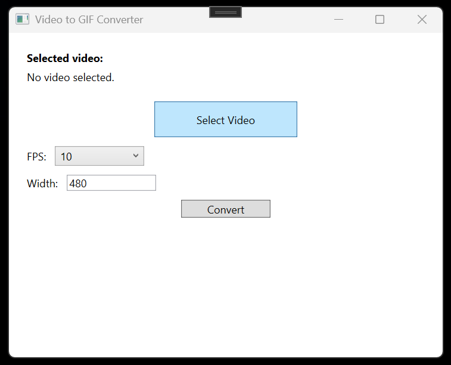

# VideoToGifConverter

A desktop application for converting videos into GIFs using FFmpeg.

## Features

- Convert videos to GIFs
- Adjustable frame rate (10–30 FPS)
- Adjustable output width
- Automatic height calculation to preserve aspect ratio
- Asynchronous conversion to keep the UI responsive
- FFmpeg error reporting
- FFmpeg availability checking
- Output file selection
- Input validation
- Overwrite protection through the Windows Save dialog

## Project Structure

### VideoToGifConverter.Core

- Conversion logic
- FFmpeg integration
- Shared models
- UI-independent services

### VideoToGifConverter.Desktop

- WPF desktop application
- User interface
- User input and validation

### VideoToGifConverter.Tests

- Unit tests

## Technologies

- C#
- .NET 10
- WPF
- FFmpeg

## Status

### v1.0

The first working version of the application is complete and has been tested with normal and invalid input scenarios.

## Planned Improvements

- GIF quality and palette optimization
- Custom height
- Preview before conversion
- Conversion cancellation
- Real conversion progress
- Drag-and-drop support
- Batch conversion
- Installer/distribution

## FFmpeg

This application uses FFmpeg for video processing.

The source repository does not include the FFmpeg executable. The
application is developed and tested with the Gyan.dev Windows
essentials build of FFmpeg 8.1.2.

See [THIRD-PARTY-NOTICES.md](THIRD-PARTY-NOTICES.md) for FFmpeg
build and licensing information.